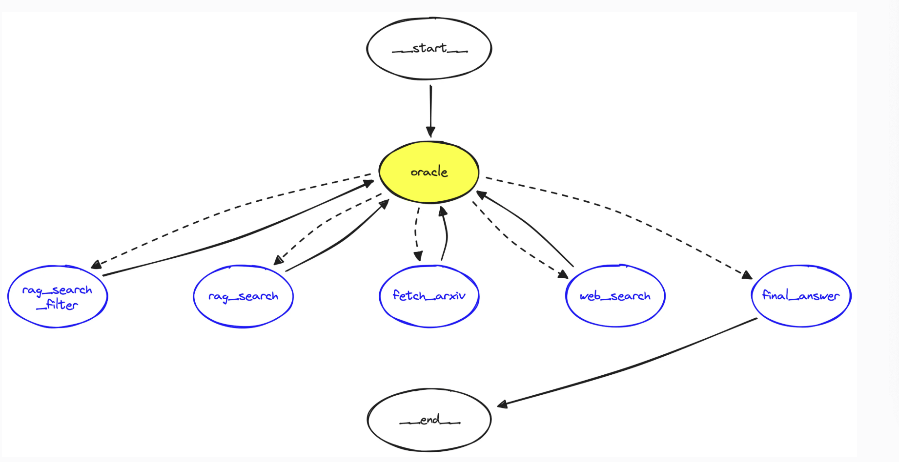

## LangGraph and Research Agents

It is a LangChain's graph based agent 
framework for building graph-based agents. It provides
"fine-grained" controls over an agent's flow and state.

### State
Agent state: It is a mutable object where we track the
current state of the agent execution as we pass
thorough the graph. Here we pass three parameters:

* `input`: The use's most recent query
* `chat_history`: It keeps previous interactions with the agent.
* `intermediate_steps`: Provides a record of all steps of all steps the research agent will take between the user asking 
a question via input and the agent providing a final answer. 

### Agent State

```python
from typing import TypedDict, Annotated
from langchain_core.agents import AgentAction
from langchain_core.messages import BaseMessage
import operator


class AgentState(TypedDict):
    input: str
    chat_history: list[BaseMessage]
    intermediate_steps: Annotated[list[tuple[AgentAction, str]], operator.add]
```


### Define the Oracle

Oracle LLM is our graph's decision maker. It decides which path
should take down our graph.It functions similarly to an 
an agent but it is much simpler; consisting of a single 
prompt, LLM, and tool instructions. The Oracle consists of an 
LLM provided with a set of potential functions (i.e. tools)
that it can decide to use. We force it to use at least one 
of those tools using the `tool_choice="any"`

```python
oracle = (
   {
       "input": lambda x: x["input"],
       "chat_history": lambda x: x["chat_history"],
       "scratchpad": lambda x: create_scratchpad(
           intermediate_steps=x["intermediate_steps"]
       ),
   }
   | prompt
   | llm.bind_tools(tools, tool_choice="any")
)
```

Our graph needs functions that consume the `AgentState` we defined earlier,
and output `intermediate_steps`. To do this, we wrap our oracle and tool
function to use the `AgentState`. We'll also define a `router` which will 
`router` which will route our state to different tool nodes based on the 
output from our oracle. 

```python
def run_oracle(state: TypedDict):
   print("run_oracle")
   print(f"intermediate_steps: {state['intermediate_steps']}")
   out = oracle.invoke(state)
   tool_name = out.tool_calls[0]["name"]
   tool_args = out.tool_calls[0]["args"]
   action_out = AgentAction(
       tool=tool_name,
       tool_input=tool_args,
       log="TBD"
   )
   return {
       "intermediate_steps": [action_out]
   }
```

The `router` routes our state to different tool. We get this
value from the `out.tool_calls[0]["name"]` value.

```python
def router(state: TypedDict):
   # return the tool name to use
   if isinstance(state["intermediate_steps"], list):
       return state["intermediate_steps"][-1].tool
   else:
       # if we output bad format go to final answer
       print("Router invalid format")
       return "final_answer"
```

The tools can run using the same function logic we define
with `run_tool`. We add the input parameters to our tool
call and the resultant output to our graph state's 
`intermediate_steps` parameter.

```python
tool_str_to_func = {
   "rag_search_filter": rag_search_filter,
   "rag_search": rag_search,
   "fetch_arxiv": fetch_arxiv,
   "web_search": web_search,
   "final_answer": final_answer
}

def run_tool(state: TypedDict):
    # use this as helper function so we repeat less code
    tool_name = state["intermediate_steps"][-1].tool
    tool_args = state["intermediate_steps"][-1].tool_input
    print(f"{tool_name}.invoke(input={tool_args})")
    # run tool
    out = tool_str_to_func[tool_name].invoke(input=tool_args)
    action_out = AgentAction(
        tool=tool_name,
        tool_input=tool_args,
        log=str(out)
    )
    return {"intermediate_steps": [action_out]}
```

## Constructing the Graph

* Nodes: steps in the graph where we execute some logic. 
This could be an LLM call, tool execution, or our final answer output.
* Edges: the connecting paths in our graph
* Entry point: specified the node from which we would enter the graph.
* Conditional Edge: allows to specify multiple potential edges from
a source node to a set of destination nodes defined by a mapping 
passed to the path parameter. If adding conditional edges from node B 
to nodes C, D, and E — all decided using a router function (more on this later), 
we would write graph.add_conditional_edges(source="node A", path=router).

```python
from langgraph.graph import StateGraph, END


# initialize the graph with our AgentState
graph = StateGraph(AgentState)


# add nodes
graph.add_node("oracle", run_oracle)
graph.add_node("rag_search_filter", run_tool)
graph.add_node("rag_search", run_tool)
graph.add_node("fetch_arxiv", run_tool)
graph.add_node("web_search", run_tool)
graph.add_node("final_answer", run_tool)


# specify the entry node
graph.set_entry_point("oracle")


# add the conditional edges which use the router
graph.add_conditional_edges(
   source="oracle",  # where in graph to start
   path=router,  # function to determine which node is called
)


# create edges from each tool back to the oracle
for tool_obj in tools:
   if tool_obj.name != "final_answer":
       graph.add_edge(tool_obj.name, "oracle")


# if anything goes to final answer, it must then move to END
graph.add_edge("final_answer", END)
```




## Invoke the Graph
```python
out = runnable.invoke({
"input": "tell me something interesting about dogs",
"chat_history": [],
})
```


So, how it works:

1) `input` and `chat_history` are going as input to the graph
2) The node called `oracle` uses the method `run_oracle`. The input and chat_history
are going as input in the 'run_oracle'. Then run oracle decides what tool
to use to answer the query.
The `run_oracle` function returns the `intermediate_steps` which here is the 
action the agent decided to chose.
3) after the oracle decides, it sends out `AgentAction` output as `intermediate_steps` which 
is then passed to the `router` to pick up the chosen action/function. Conditional
edge is used to connect the `source=oracle` with the functions, and `router` is
used as function `path=router` to determine which node (function) is called next.
4) After running a function, the graph sends back the output of the functions to the
`oracle` which decides what to do next:
     * call another `function/tool`
     * or go to the `final_answer` if the query can be answered
